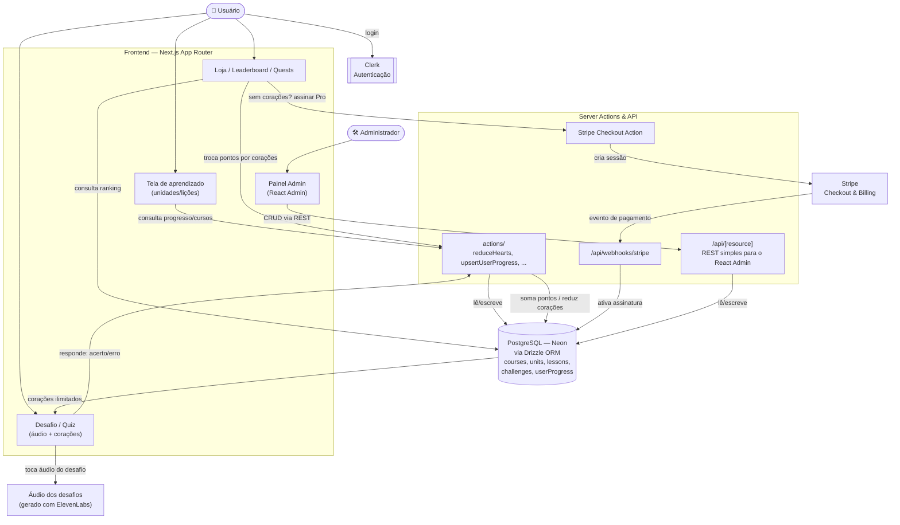

<div align="center">

# 🦉 Lingo

### Plataforma gamificada de aprendizado de idiomas — estilo Duolingo

[](https://nextjs.org)
[](https://react.dev)
[](https://www.typescriptlang.org)
[](https://orm.drizzle.team)
[](https://neon.tech)
[](https://clerk.com)
[](https://stripe.com)

</div>

---

## 📋 Sobre o projeto

**Lingo** (nome interno do `package.json`) é uma plataforma gamificada de aprendizado de idiomas, no estilo **Duolingo**, construída com **Next.js 14**. Usuários avançam por cursos organizados em unidades e lições, respondem desafios com áudio, ganham **pontos (XP)**, gerenciam um sistema de **corações (vidas)**, competem em um **leaderboard**, cumprem **missões (quests)** e podem assinar um **plano Pro via Stripe** para corações ilimitados. Um **painel administrativo** completo permite gerenciar todo o conteúdo educacional.

> 💡 Este README foi elaborado a partir do `package.json` real do repositório (que confirma as funcionalidades já descritas no próprio README original do projeto) e da estrutura de pastas pública (`actions/`, `app/`, `db/`, `store/`, `scripts/`). Ajuste os detalhes finos conforme a implementação exata do seu fork.

---

## ✨ Funcionalidades

| Funcionalidade | Descrição |
|---|---|
| 📚 **Cursos, unidades e lições** | Estrutura de aprendizado progressiva, com desafios por lição |
| 🔊 **Áudio nos desafios** | Efeitos sonoros e áudio de pronúncia (narração gerada via ElevenLabs AI, com personagens ilustrados por KenneyNL) |
| ❤️ **Sistema de corações (vidas)** | Erros consomem corações; sem corações, o usuário é bloqueado até repor |
| 🌟 **Pontos / XP** | Respostas corretas geram pontos, usados no leaderboard e na loja |
| 💔 **Popup de "sem corações"** | Interrupção da lição quando os corações acabam |
| 🚪 **Confirmação de saída** | Modal de confirmação ao tentar sair de uma lição em andamento |
| 🔄 **Prática de lições antigas** | Revisar lições já concluídas para recuperar corações |
| 🏆 **Leaderboard** | Ranking dos usuários por pontuação |
| 🗺️ **Missões (Quests)** | Metas por marcos de pontuação, com recompensas |
| 🛍️ **Loja** | Troca de pontos por corações extras |
| 💳 **Plano Pro (Stripe)** | Assinatura para corações ilimitados |
| 🏠 **Landing page** | Página inicial de apresentação do produto |
| 📊 **Painel administrativo** | CRUD de cursos, unidades, lições, desafios e opções via React Admin |
| 📱 **Responsivo** | Interface adaptada para mobile |

---

## 🛠️ Tech Stack

| Camada | Tecnologia |
|---|---|
| **Framework** | Next.js 14 (App Router), React 18, Server Actions |
| **UI** | Tailwind CSS, Radix UI, shadcn/ui, `sonner`, `react-confetti`, `react-circular-progressbar` |
| **Autenticação** | Clerk |
| **Banco de dados** | PostgreSQL (Neon serverless) |
| **ORM** | Drizzle ORM + Drizzle Kit (studio, push, seed) |
| **Pagamentos / Assinaturas** | Stripe (plano Pro) |
| **Painel administrativo** | React Admin + `ra-data-simple-rest` |
| **Geração de voz (conteúdo)** | ElevenLabs AI (narração dos desafios) |
| **Estado global** | Zustand |
| **Utilitários** | `react-use` |
| **Linguagem** | TypeScript 5 |

---

## 🏗️ Arquitetura



### Como funciona o fluxo

1. O usuário se autentica via **Clerk** e acessa a tela de **aprendizado**, onde os cursos, unidades e lições disponíveis são carregados via **Server Actions** que consultam o **Postgres (Neon)** através do **Drizzle ORM**.
2. Ao entrar em uma lição, cada **desafio** apresenta opções de resposta com **áudio** (narração pré-gerada com ElevenLabs, associada a personagens ilustrados). Respostas corretas somam **pontos**; respostas erradas consomem **corações**.
3. Se os corações acabarem, o usuário vê um popup bloqueando o progresso — podendo **praticar lições antigas** para recuperar corações ou ir até a **loja** trocar pontos por corações extras.
4. O **leaderboard** e as **quests (missões)** são calculados a partir da pontuação acumulada de cada usuário, consultada no banco de dados.
5. Para eliminar o limite de corações, o usuário pode assinar o **plano Pro**, que cria uma sessão de **Stripe Checkout**; o pagamento confirmado dispara um **webhook** que ativa a assinatura no banco.
6. Um **administrador** acessa o **painel administrativo** (construído com **React Admin**, consumindo uma API REST simples do próprio Next.js) para gerenciar cursos, unidades, lições, desafios e suas opções.

> Ajuste nomes de tabelas, Server Actions e rotas conforme a implementação real em `db/`, `actions/` e `app/`.

---

## 📁 Estrutura do projeto

```
nextjs-duolingo-clone/
├── actions/              # Server Actions (progresso do usuário, corações, assinatura)
├── app/                  # Rotas, páginas, layouts e API routes (incl. painel /admin)
├── components/           # Componentes de UI reutilizáveis
├── db/                   # Schema do Drizzle e cliente de conexão
├── lib/                  # Funções utilitárias (Stripe, helpers)
├── public/               # Assets estáticos (imagens, áudio dos desafios)
├── scripts/              # Scripts de seed/reset/prod do banco de dados
├── store/                # Estado global (Zustand — modais de saída, sem corações, etc.)
├── constants.ts          # Constantes da aplicação (limites, valores da loja)
├── drizzle.config.ts     # Configuração do Drizzle Kit
├── middleware.ts         # Middleware de proteção de rotas (Clerk)
├── components.json       # Configuração do shadcn/ui
├── tailwind.config.ts
├── next.config.mjs
├── postcss.config.js
├── tsconfig.json
├── .eslintrc.json
├── package.json
└── README.md
```

---


## 📜 Scripts disponíveis

| Comando | Descrição |
|---|---|
| `npm run dev` | Inicia o servidor de desenvolvimento |
| `npm run build` | Gera o build de produção |
| `npm run start` | Inicia o servidor em modo produção |
| `npm run lint` | Roda o ESLint no projeto |
| `npm run db:push` | Aplica o schema do Drizzle no banco de dados |
| `npm run db:studio` | Abre o Drizzle Studio (UI de administração do banco) |
| `npm run db:seed` | Popula o banco com dados de exemplo |
| `npm run db:prod` | Executa o seed voltado para produção |
| `npm run db:reset` | Reseta o banco de dados |

---

## 🗺️ Roadmap

- [ ] Documentar o schema completo do Drizzle (`db/schema.ts`)
- [ ] Mapear todas as Server Actions (`actions/`)
- [ ] Detalhar as rotas REST usadas pelo painel React Admin
- [ ] Adicionar testes automatizados
- [ ] Definir licença do projeto

